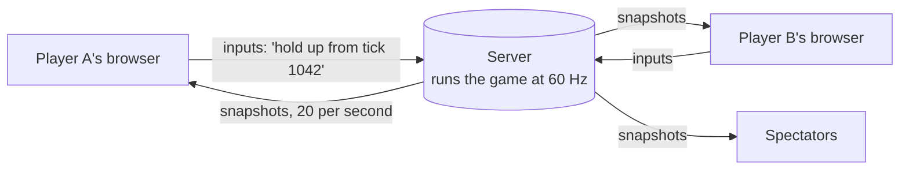
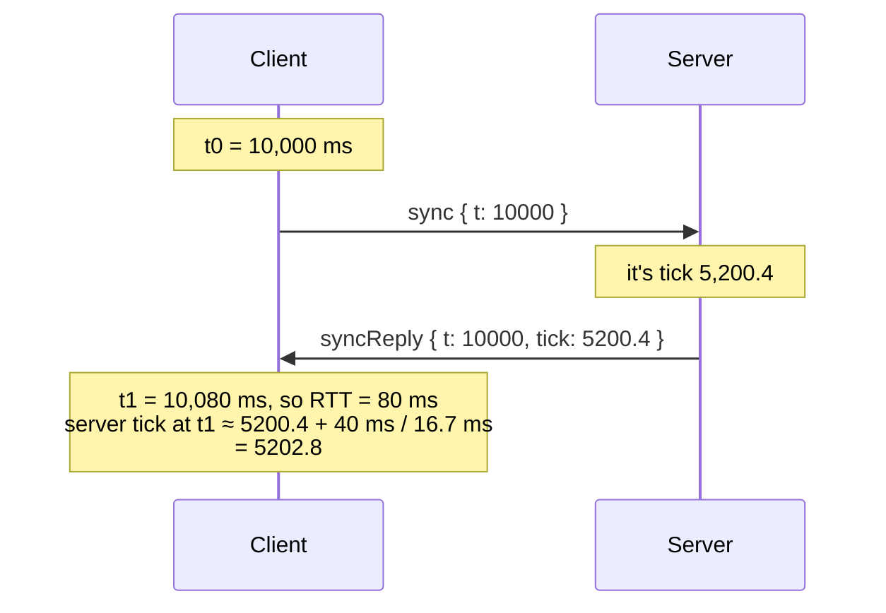
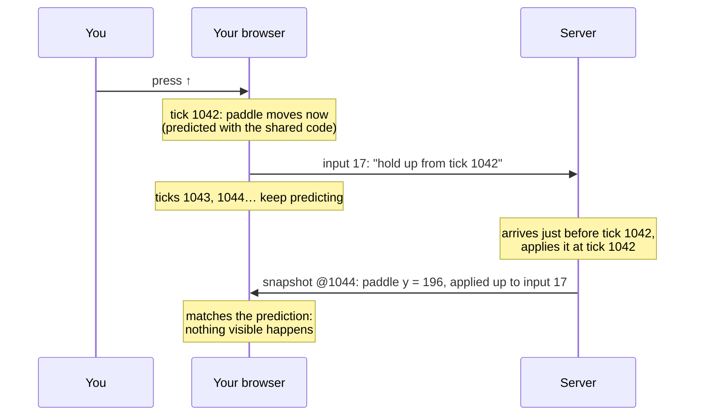
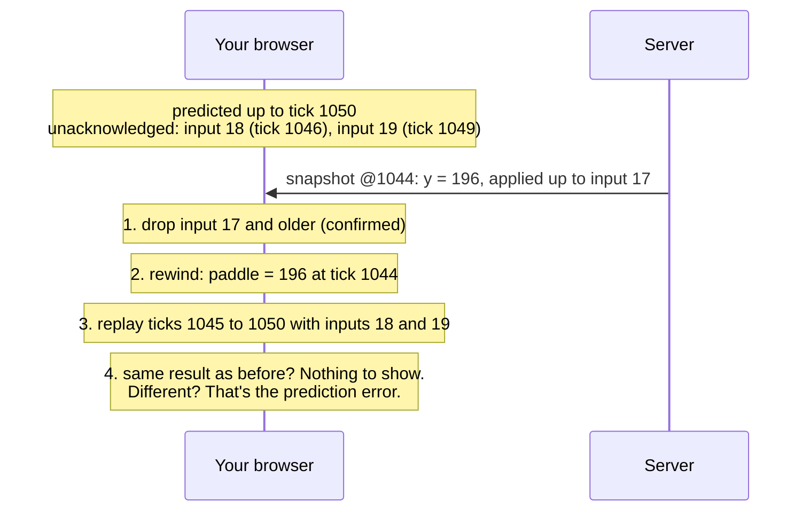
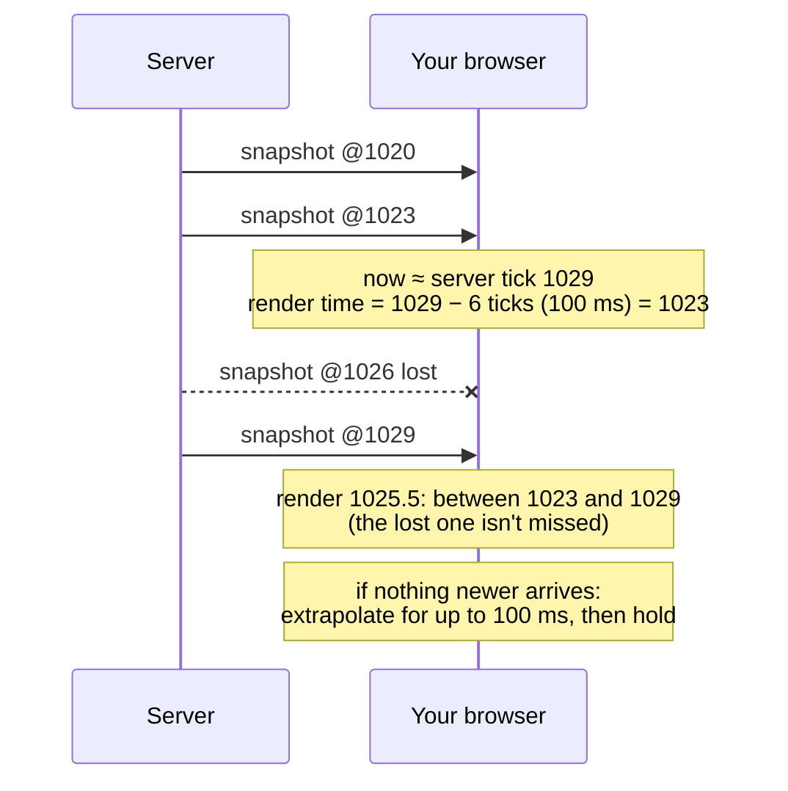
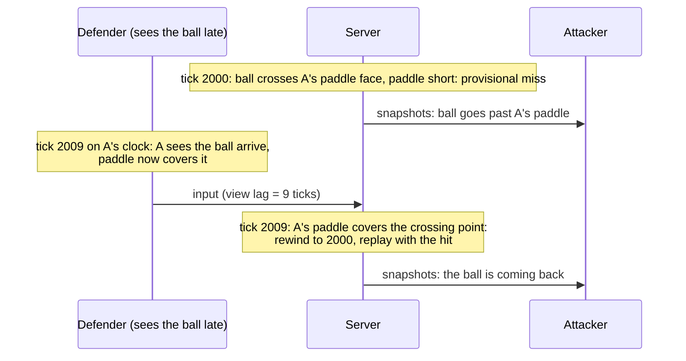

# How the netcode works

Online games have a problem that single-player games don't: **the game exists in several places at once, and the network between them is slow, uneven and lossy.** A message from a player in London to a server in Virginia takes tens of milliseconds even on a good day. Some messages arrive late, some out of order, and some never arrive.

This Pong uses the same techniques real multiplayer games use to hide that, and lets you switch each one off in the **network lab** to feel what it does. This page explains them in order: first the two foundations everything rests on, then the four techniques, then the one judgement call.

Each section has the problem in plain words, a timeline, how it's done here (with links to the code), and what it costs.

- [The foundations: one authority, one deterministic simulation](#the-foundations)
- [1. Clock synchronisation](#1-clock-synchronisation): what time is it on the server?
- [2. Client-side prediction](#2-client-side-prediction): make your own paddle instant
- [3. Server reconciliation](#3-server-reconciliation): fix the guesses without throwing away your moves
- [4. Entity interpolation](#4-entity-interpolation): make everything else smooth
- [5. Hit fairness and lag compensation](#5-hit-fairness-and-lag-compensation): who decides if the ball hit?
- [Inputs on an unreliable network](#inputs-on-an-unreliable-network)
- [The network lab](#the-network-lab)
- [Numbers](#numbers)

---

## The foundations

### The server is the only authority

In the [original 2022 version](ORIGINAL.md), one player's browser ran the ball and told the server where it was, and the server passed that on. Any player could send "the ball is in your goal" and the other would believe it.

Here, the server runs the only game that counts. Clients send **intentions** ("I'm pressing up, starting at tick 1042"), never results ("my paddle is at y = 210"). The server simulates, and every 50 ms it sends everyone a **snapshot**: where everything is, the score, and which of each player's inputs it has applied.

This stops cheating at the source: a modified client can only ask, and the server checks every request (see [SECURITY.md](../SECURITY.md)). The cost is that the server's word arrives late, which is exactly the problem the rest of this page solves.

### One deterministic simulation, shared by everyone

The rules live in one pure function, [`step(state, inputs)`](../shared/step.ts), that advances the game by exactly 1/60 of a second. The server runs it to decide what happens; browsers run the same code to predict and to draw; the offline mode runs it with no server at all.

For that to work, **the same state and inputs must produce bit-for-bit the same result on every machine**:

- **Fixed timestep.** The game always advances in 1/60 s steps, never "however long the last frame took". An accumulator turns wall-clock time into whole steps ([`Room.advance`](../server/rooms/Room.ts)), so a 144 Hz monitor or a busy server doesn't change the speed of the game. (The original ran faster on faster screens.)
- **Only operations every engine computes identically.** `+ − × ÷` and `sqrt` are correctly rounded under IEEE 754, so V8, SpiderMonkey and JavaScriptCore agree on them. Trigonometry isn't, so it's never used: bounce and serve directions are built from a slope and normalised with `sqrt` ([`physics.ts`](../shared/physics.ts)).
- **Seeded randomness inside the state.** Serve angles come from a small PRNG whose state is part of the game state ([`rng.ts`](../shared/rng.ts)), so a replay draws the same numbers.
- **Values rounded every tick** to 1/100 of a unit, so a snapshot carries exactly the server's numbers.

A test replays the same 20,000-tick input log twice and compares every state, and a golden hash catches any accidental change to the rules ([`simulation.test.ts`](../tests/shared/simulation.test.ts)).

The ball also never tunnels through a paddle. At its top speed it moves 18 units per tick, and a paddle is 12 thick, so "move, then check for overlap" would let it pass straight through. [`sweepBall`](../shared/physics.ts) computes the exact moment within the step that the ball meets each wall or paddle face instead (continuous collision), and is tested at every speed and angle.

---

## 1. Clock synchronisation

**The problem.** Every other technique needs the client to know "which server tick is it right now?" Your computer's clock and the server's don't agree, and you can't just ask the server, because its answer takes time to arrive.

**The idea** is the same one NTP uses to set your computer's clock. The client sends its own time; the server replies with its tick; the client notes when the reply arrived. The round trip is the difference, and if the trip out and the trip back took about as long, the server's tick when the reply *arrived* was its reported tick plus half the round trip.

**Why it needs care.** One sample is noisy: if the reply happened to sit in a queue, the server looks further ahead than it is. So [`ClockSync`](../client/src/netcode/ClockSync.ts):

- keeps the last 16 samples and trusts only the **fastest half** (a fast round trip leaves little room for one direction to have been slower than the other), then takes their median;
- **slews** towards that estimate a little per sample instead of jumping, so time on screen never lurches, but **snaps** if it's more than 4 ticks off (the first sync, or the server skipped time);
- smooths the round-trip time and its variation the way TCP does (RFC 6298), because prediction and interpolation both size themselves from those numbers.

It syncs 5 times quickly at the start of a match, then once a second.

**Trade-offs.** It assumes the two directions take about as long. On a link that is much slower one way, the estimate is off by half the difference, and nothing measured from one end alone can fix that. Here, a tick of error only shifts the prediction lead slightly, and reconciliation absorbs it.

---

## 2. Client-side prediction

**The problem.** Without it, pressing a key does nothing you can see until the input has reached the server, been simulated, and come back in a snapshot: a full round trip, plus up to one snapshot interval, plus the interpolation delay everything else is drawn with (technique 4). With a 100 ms round trip that is well over 200 ms between pressing a key and seeing the paddle move. It feels like steering through syrup. (Network lab: turn **Prediction** off and pick **Satellite**.)

**The idea.** Your own paddle is the one thing your computer knows as much about as the server does: it knows exactly what you pressed. So the client applies your input **immediately**, using the same [`stepPaddle`](../shared/physics.ts) the server will use, and shows the result. Because the simulation is deterministic, in the normal case it computes exactly the position the server will compute.

**How it's done here** ([`Prediction.ts`](../client/src/netcode/Prediction.ts), [`GameClient.update`](../client/src/netcode/GameClient.ts)):

- The client runs **ahead** of the server by about half a round trip plus a margin for jitter. It stamps each input with the tick it applied it at, so the input reaches the server just before the server simulates that tick. (If it's late, the server applies it at the next tick, and reconciliation fixes the small difference.)
- Inputs are sent as numbered **changes** ("from tick T, hold direction D"), not as a stream of keystates. The predictor keeps every change the server hasn't acknowledged yet, and its own predicted paddle for each recent tick.
- Rendering blends between the last two predicted ticks, so the paddle glides on 120 and 144 Hz screens even though the simulation runs at 60.

**Trade-offs.**

- Only *your* paddle can be predicted. The ball depends on the other player's inputs, which you don't have yet, so it is shown slightly in the past instead (technique 4). That mismatch between "your paddle now" and "the ball a moment ago" is the root of the hit-fairness question in technique 5.
- Prediction can be wrong, so it needs reconciliation.

---

## 3. Server reconciliation

**The problem.** Prediction guesses; the server decides. A snapshot says where the server had your paddle at tick S. By the time it arrives, your browser has already predicted several ticks past S with inputs the server hadn't seen yet. If the client just jumps to the server's position, it throws those ticks away, and your paddle **snaps backwards** by a round trip's worth of movement on every snapshot: rubber-banding. (Network lab: 150 ms latency, **Reconciliation** off, then move.)

**The idea.** Rewind to the server's state at tick S, then **replay** every input the server hasn't acknowledged yet, tick by tick, up to the present.

If the server did exactly what was predicted, the replay lands on exactly the same position (determinism again), and nothing on screen changes. If not (an input arrived late, a packet was lost, the match paused), it lands on the corrected position.

**How it's done here** ([`Reconciliation.ts`](../client/src/netcode/Reconciliation.ts), [`GameClient.onSnapshot`](../client/src/netcode/GameClient.ts)):

- Every snapshot carries, per player, the sequence number of the last input the server applied. Everything up to it is dropped from the unacknowledged list.
- Small corrections (under 60 units) are **blended** out over about 50 ms instead of applied in one frame, so they read as a slight drift rather than a jump. Large ones snap, because a slow slide over a big distance looks worse than a jump.
- Each correction is counted; the lab shows corrections per second.
- The headless harness checks that after every reconcile the client's history at tick S equals the server's state bit for bit, that a steady 100 ms link produces **zero** corrections, and that after you stop pressing keys the prediction converges exactly to the server's position under every lab preset ([`netcode.test.ts`](../tests/netcode/netcode.test.ts)).

**Trade-offs.** Replaying costs a few `stepPaddle` calls per snapshot, which is trivial for one paddle. In a game with complex physics, replaying the whole world is expensive, which is why many games predict only the player's own character.

---

## 4. Entity interpolation

**The problem.** Snapshots arrive 20 times a second, unevenly, and some never arrive. Drawing the ball and the opponent wherever the latest snapshot says makes them jump 20 times a second, and stutter or freeze whenever the network hiccups. (Network lab: turn **Interpolation** off.)

**The idea.** Draw everything else **slightly in the past**, at a "render time" a little behind the server, so that there is almost always a snapshot on each side of it, and draw the motion between them.

**How it's done here** ([`Interpolation.ts`](../client/src/netcode/Interpolation.ts)):

- **The delay adapts.** It aims for two snapshot intervals (100 ms at 20 Hz) plus three times the measured arrival jitter (an RFC 3550-style estimator), between 100 and 400 ms. On a calm network you see the opponent 100 ms late; on bad Wi-Fi the delay grows so that motion stays smooth.
- **Time never runs backwards.** The delay changes at most 10% as fast as real time, and render time is clamped to never decrease, even if the clock estimate is corrected. The harness checks this under every preset.
- **The ball follows its real path.** Linear blending between two snapshots 50 ms apart cuts the corner when the ball bounces off a wall between them. Instead the client traces the ball forward from the older snapshot and backward from the newer one with the shared physics, so it bounces in the right place, and switches from one trace to the other at the paddle face when there was a hit in between.
- **Gaps:** past the newest snapshot it extrapolates for up to 100 ms, then holds still until data arrives, rather than guessing wildly.
- **Score and countdown** come from the snapshot at render time, so the score changes when you *see* the ball leave, not 100 ms before.

**Trade-offs.** Everything that isn't you is shown about 100 ms (or more) late. That is the price of smoothness, and why the delay is kept as small as the measured jitter allows. It is also the other half of the hit-fairness problem below.

---

## 5. Hit fairness and lag compensation

**The problem.** Put the last two techniques together: your paddle is drawn **ahead** of the server (prediction), and the ball **behind** it (interpolation). When you see the ball touch your paddle, you're looking at the ball from tick T next to your paddle from tick T + d, where d (your *view lag*) is the interpolation delay plus the prediction lead. The server judges the hit at tick T with your paddle at tick T. If you were still moving into place, you saw a hit and the server scored a miss. Nobody cheated; both views are right about their own moment.

**One answer: let the server look at what you saw.** With `LAG_COMPENSATION=true`, every input carries the client's view lag. When the ball misses a paddle at tick T, the server waits until tick T + d, checks the paddle *then*, and if it covers the point where the ball crossed, it **rewinds** to tick T, replays it with the hit, and re-simulates every tick since from its recorded inputs ([`LagCompensator.ts`](../server/rooms/LagCompensator.ts)). The deterministic simulation makes the replay exact.

**The trade-off, honestly.** It doesn't remove the disagreement; it moves it to the other player. The attacker sees the ball go past the paddle and then jump back, sometimes after the point appeared on the scoreboard. A client can also lie about its view lag to get extra reach. So the view lag is **capped** (150 ms, 9 ticks, by default), which bounds the extra reach to what a paddle travels in 150 ms: 81 units, less than one paddle length (90). It is **off by default**, because in Pong both players see the ball equally late and the "ball came back" artefact is very visible on a small, empty field. In a shooter, where the person shooting matters most and the target rarely notices, the trade usually goes the other way. [HIT_FAIRNESS.md](HIT_FAIRNESS.md) has the full argument.

---

## Inputs on an unreliable network

Real games send game traffic over UDP, which can lose, duplicate and reorder messages. Socket.io runs over TCP, which never does, but the lab's [network simulator](../client/src/net/NetworkSimulator.ts) deliberately reintroduces all three, so the input protocol is built for them:

- **Redundancy:** every input packet carries all unacknowledged changes (up to 16), and the client resends them every 100 ms until acknowledged. A lost packet costs one resend, not a stuck paddle.
- **Exactly once, in order:** the server accepts each sequence number once, ignores older or duplicate ones, and applies each change at its stamped tick ([`InputQueue.ts`](../server/rooms/InputQueue.ts)).
- **Plausibility:** an input for an earlier tick than the previous one, more than 30 ticks in the future, or one change too many for the same tick is impossible for an honest client, so it is rejected and counts as abuse.
- **Session traffic stays reliable:** joining rooms, rematches and room info are acknowledged requests, the way real games keep a reliable channel next to the fast one.

## The network lab

The lab is a dashboard on top of all this ([`LabPanel.ts`](../client/src/ui/LabPanel.ts)). The sliders feed the network simulator; the switches flip the techniques; **Show the truth** draws a dashed outline of the newest raw snapshot, so you can see how far "what the server last said" is from "what you see". The live numbers are measured in your browser: round trip and jitter from clock sync and snapshot arrivals, snapshots lost from gaps in the tick sequence, bytes per second from the size of every message, corrections from reconciliation.

Things to try, one change at a time:

| Set | Turn off | What you'll feel |
|---|---|---|
| Satellite | Prediction | Your paddle starts moving well after you press the key. |
| 150 ms latency | Reconciliation | Your paddle jerks back on every server update while you move. |
| Same city | Interpolation | The ball and the opponent move in visible steps, 20 per second. |
| Bad Wi-Fi | nothing, then Interpolation | With it on, the delay grows and motion stays smooth; with it off, everything stutters. |
| any | (Show the truth on) | The dashed outline runs ahead of the ball: that gap is the interpolation delay. |

## Numbers

Real measurements (bandwidth per player at 20 and 30 Hz, server CPU and memory per room, where the server's timing starts slipping) are in [BENCHMARKS.md](BENCHMARKS.md), each with the command that produced it and the machine it ran on.

## Where to read the code

| Technique | File |
|---|---|
| Simulation, rules, collision | [`shared/step.ts`](../shared/step.ts), [`shared/physics.ts`](../shared/physics.ts) |
| Wire protocol and validation | [`shared/protocol.ts`](../shared/protocol.ts) |
| Server loop, inputs, snapshots | [`server/rooms/Room.ts`](../server/rooms/Room.ts), [`server/rooms/InputQueue.ts`](../server/rooms/InputQueue.ts) |
| Lag compensation | [`server/rooms/LagCompensator.ts`](../server/rooms/LagCompensator.ts) |
| Clock sync | [`client/src/netcode/ClockSync.ts`](../client/src/netcode/ClockSync.ts) |
| Prediction | [`client/src/netcode/Prediction.ts`](../client/src/netcode/Prediction.ts) |
| Reconciliation | [`client/src/netcode/Reconciliation.ts`](../client/src/netcode/Reconciliation.ts) |
| Interpolation | [`client/src/netcode/Interpolation.ts`](../client/src/netcode/Interpolation.ts) |
| How they fit together | [`client/src/netcode/GameClient.ts`](../client/src/netcode/GameClient.ts) |
| Simulated network | [`client/src/net/NetworkSimulator.ts`](../client/src/net/NetworkSimulator.ts) |
| Offline mode (same simulation, no server) | [`client/src/offline/OfflineMatch.ts`](../client/src/offline/OfflineMatch.ts) |
| Headless test harness | [`tests/harness/harness.ts`](../tests/harness/harness.ts) |
